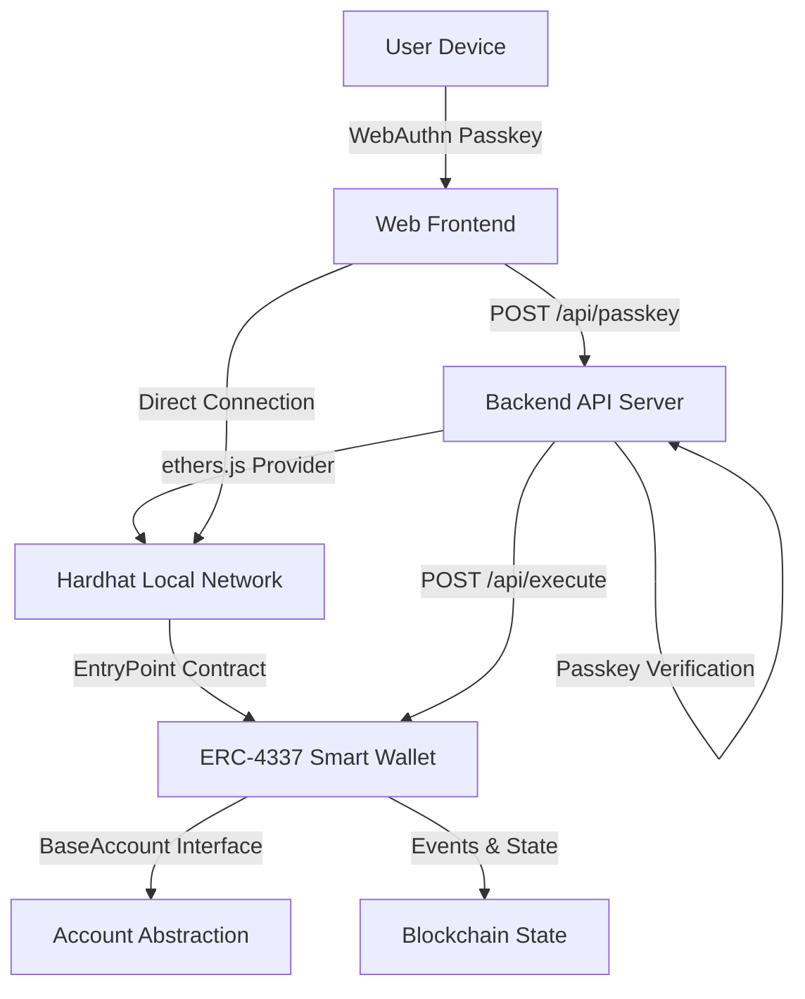

# ERC-4337 Smart Wallet with Passkey Control

This project implements an ERC-4337-compliant Smart Wallet that uses Passkeys (WebAuthn) for authentication, leveraging Solidity with OpenZeppelin for the smart contract, JavaScript for the frontend, a Node.js backend API for off-chain Passkey verification, and a local Hardhat network for development and testing.

## System Architecture

The following diagram illustrates the high-level architecture of the system:



**Component Details:**
- **User Device**: Initiates WebAuthn Passkey authentication (biometric/hardware key)
- **Web Frontend** (`frontend/`): HTML/JS application with ethers.js for blockchain interaction
- **Backend API Server** (`backend/`): Express.js server on port 3000 for Passkey verification
- **Hardhat Local Network**: Ethereum simulation on localhost:8545
- **ERC-4337 Smart Wallet**: Account abstraction contract with EntryPoint integration
- **Account Abstraction**: BaseAccount implementation with signature validation
- **Blockchain State**: Transaction history and wallet state storage
- **Blockchain State**: Stores wallet data and transaction history.

## Setup Instructions

1. **Install Node.js and npm**: Ensure Node.js (v16 or later) and npm are installed. Download from [nodejs.org](https://nodejs.org/) if needed.
2. **Navigate to Project Directory**: Open a terminal and navigate to the project folder.
3. **Install Dependencies**: All required dependencies are already configured in package.json:
   ```bash
   npm install
   ```
   This installs:
   - `@account-abstraction/contracts` - ERC-4337 implementation
   - `@openzeppelin/contracts` - Security and utility contracts
   - `hardhat` - Development framework
   - `@nomicfoundation/hardhat-toolbox` - Testing utilities
4. **Compile Contracts**: Compile the smart contracts:
   ```bash
   npm run compile
   ```
5. **Run Tests**: Execute the test suite to verify everything works:
   ```bash
   npm test
   ```

## Usage Instructions

1. **Start Hardhat Local Network**:
   ```bash
   npm run node
   ```
   Runs local Ethereum network on localhost:8545

2. **Start Backend API Server**:
   ```bash
   cd backend
   npm install
   npm start
   ```
   Runs Express server on localhost:3000

3. **Launch Frontend**:
   ```bash
   cd frontend
   npm install
   npm start
   ```
   Serves frontend on localhost:8088

4. **Run Tests**:
   ```bash
   npm test
   ```
   Runs 21 comprehensive tests covering:
   - Integration between all system components
   - Smart contract functionality and security
   - API endpoint validation
   - Authentication flow verification

5. **System Integration Flow**:
   - Register Passkey via WebAuthn
   - Backend verifies Passkey signatures
   - Frontend connects to Hardhat network
   - Execute transactions through Smart Wallet

## Passkey Integration

The system uses WebAuthn for Passkey-based authentication, which provides a secure, phishing-resistant alternative to traditional private keys. The JavaScript frontend interacts with the WebAuthn API to generate and verify Passkey signatures. The Node.js backend API processes these signatures off-chain, validating them before relaying the necessary data to the ERC-4337 Smart Wallet contract via ethers.js. This off-chain verification reduces gas costs and enhances security.

## Smart Contract Features

- **ERC-4337 Compliance**: Implements BaseAccount for account abstraction
- **EntryPoint Integration**: Works with official EntryPoint contract
- **Owner Management**: Secure owner updates with proper access control
- **Batch Transactions**: Execute multiple transactions in a single call
- **Gas Optimization**: Efficient signature validation and execution

## Testing

The project includes comprehensive tests covering:
- **Smart Contract Tests**: Contract deployment, transaction execution, owner management, batch processing
- **Integration Tests**: Backend API, passkey authentication, smart contract interaction
- **System Integration**: Complete frontend ↔ backend ↔ smart contract flow
- **Security Tests**: Access control, authentication requirements, signature verification
- **Gas Optimization**: Efficient execution with proper gas reporting

**Test Results: 21/21 passing** ✅
- 5 Integration tests (API + Smart Contract)
- 7 SmartWallet tests (ERC-4337 compliance)
- 9 Lock contract tests (Reference implementation)

## Project Structure

```
ERC-4337_Smart_Wallet/
├── contracts/
│   ├── SmartWallet.sol    # ERC-4337 compliant smart wallet
│   └── Lock.sol           # Example timelock contract
├── test/
│   ├── SmartWallet.js     # Smart wallet comprehensive tests
│   └── Lock.js            # Lock contract tests
├── frontend/
│   ├── index.html         # WebAuthn UI interface
│   ├── app.js             # Frontend logic with ethers.js
│   └── package.json       # Frontend dependencies
├── backend/
│   ├── server.js          # Express API server
│   └── package.json       # Backend dependencies
├── ignition/modules/      # Hardhat deployment modules
├── hardhat.config.js      # Hardhat configuration
└── package.json           # Main project dependencies
```

## API Endpoints

**Backend Server (localhost:3000):**
- `POST /api/passkey` - Passkey registration/authentication
- `POST /api/execute` - Smart contract transaction execution
- `GET /` - Serves frontend static files

**Smart Contract Methods:**
- `validateUserOp()` - ERC-4337 user operation validation
- `execute()` - Single transaction execution (tested ✅)
- `executeBatch()` - Multiple transaction execution (tested ✅)
- `updateOwner()` - Owner management (tested ✅)
- `getNonce()` - Nonce management (tested ✅)

**Integration Verification:**
- ✅ Passkey registration and authentication
- ✅ Backend API endpoints (`/api/passkey`, `/api/execute`)
- ✅ Smart contract interaction through EntryPoint
- ✅ Authentication requirement enforcement
- ✅ Transaction execution with proper access control
